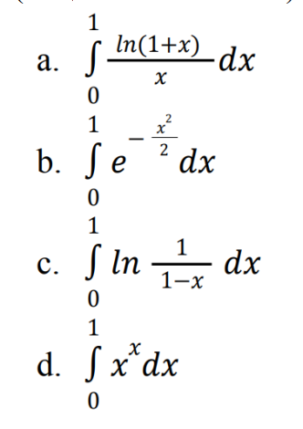

# Лабораторная работа №1.6

# Задание
Вычислить значения интегралов используя метод трапеций с точностью ε, где ε
(вещественное число) подаётся программе в виде аргумента командной строки:



# Запуск

```
make
./main.out epsilon
```

# Тесты
```
./main.out 0.1
```

```
./main.out -5
```

```
./main.out 0
```

```
./main.out 0.05
```

```
./main.out 0.00001
```

```
./main.out 0.01
```